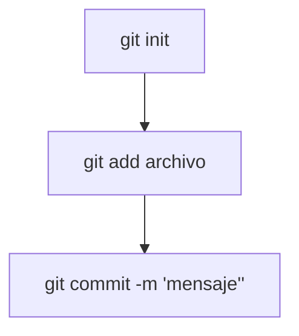
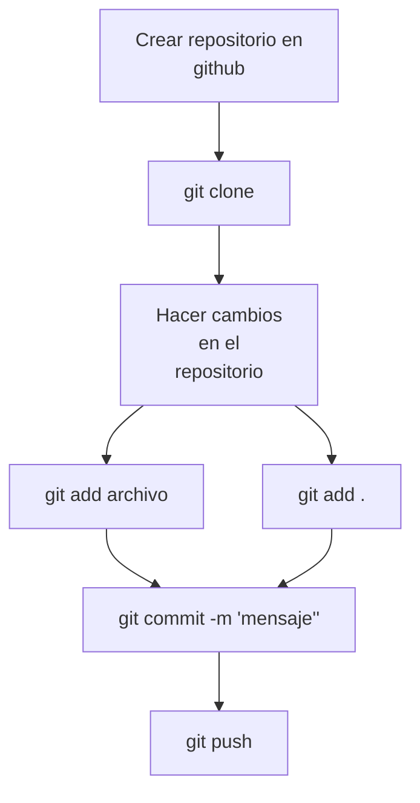

# Flujo de trabajo en local

Esto solo nos sirve si no queremos nuestro repositorio en github

```mermaid
flowchart TD

start["git init"]
add["git add archivo"]
commit[git commit -m 'mensaje'']

start --> add --> commit
```

# Flujo de trabajo en remoto

Si tenemos un repositorio en github ya creado

```mermaid
flowchart TD

init["Crear repositorio en 
github"]
clone["git clone <url>"]
cambios["Hacer cambios 
en el 
repositorio"]
add["git add archivo"]
commit[git commit -m 'mensaje'']

init --> clone --> cambios --> add --> commit

cambios --> add_all["git add ."] --> commit

commit --> push[git push]
```