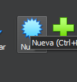
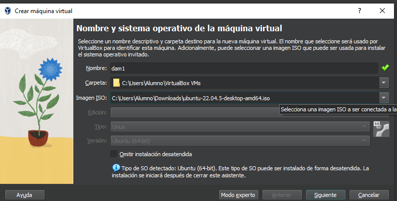
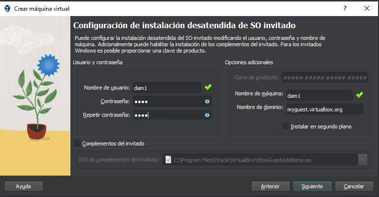
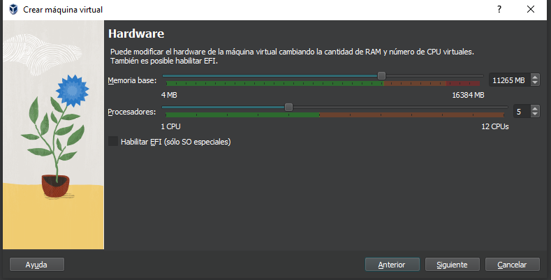
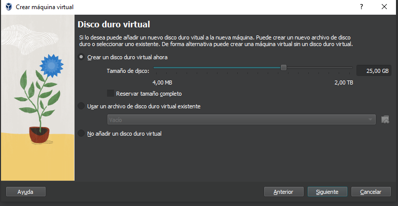
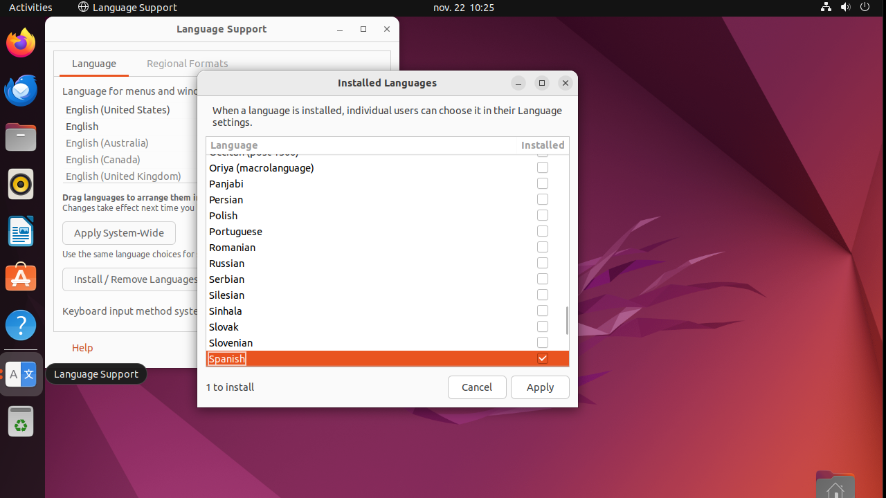
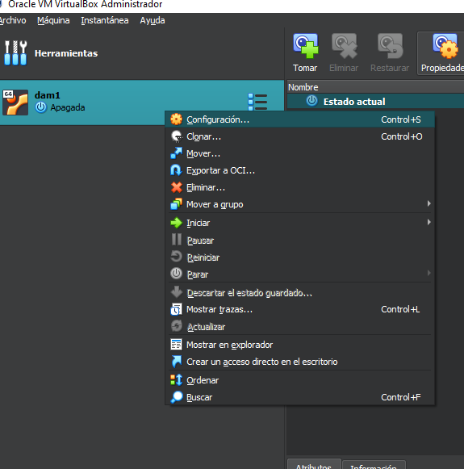
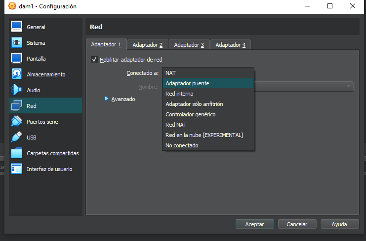

# Instalar Ubuntu como máquina virtual

## Instalar VirtualBox

[Descarga](https://www.virtualbox.org/) e instala VirtualBox.

## Instalación de Ubuntu

[Descarga](https://releases.ubuntu.com/jammy/) la imagen de Ubuntu, en clase usaremos la versión 22.04.

Cuando tengas tu archivo `.iso` de Ubuntu, abre VirtualBox.

1. Haz click en `Nueva` para crear una maquina virtual nueva.



2. Ponle un nombre, en `Imagen ISO` busca el archivo `.iso` que descargaste.



3. Configura tu nombre de usuario y contraseña, estos son los que usarás tanto para iniciar sesion como para acceder a permisos de superusuario con `sudo`.



4. Configura la RAM y CPU según tu hardware.



5. Asigna memoria a la maquina virtual, dependiendo de la que tengas disponible.



6. Una vez termine arrancará la maquina y empezará el proceso de instalación y configuración.

## Configuración de Ubuntu

Antes de poder usar el sistema operativo, tendrás que configurar algunos aspectos.

Para poder usar la terminal y escribir correctamente con el teclado en Español entra en las opciones de lenguaje y establece el idioma principal a español, configuralo también en `Regional Formats`



## Obtener permisos de superusuario

Para poder instalar software y realizar cambios en el sistema, necesitarás permisos de superusuario, estos se obtienen con el comando `sudo` seguido del comando que quieras ejecutar.

Para añadir tu usuario a la lista de superusuarios, abre la terminal y lanza:

```bash
su -
usermod -aG sudo <tu-usuario>
```

Reemplaza `<tu-usuario>` por tu nombre de usuario.

## Exponer tu máquina al host

Ahora mismo tu máquina virtual está en modo `NAT`, corriendo en una red virtual aislada de tu sistema operativo principal, si quieres poder comunicarte con ella, por ejemplo, al lanzar un servidor http con `python -m http.server`, deberás configurarla en modo `Adaptador Puente`.





## Actualización e instalación de software

Estás listo para usar linux! Pero antes es buena idea actualizarlo abriendo la terminal y lanzando:

```bash
sudo apt update
sudo apt upgrade
```

Una vez actualizado, puedes instalar los paquetes y software que necesites usar.

Os he incluido el archivo [config.sh](https://github.com/diegondt/codebase-dam1/blob/main/instalar-linux/config.sh) con el que podeis instalar *casi* todo lo que necesitaremos en el curso:

- **vscode**: editor de código, lo usaremos para crear código.
- **git**: para crear, editar y gestionar repositorios locales.
- **gh**: para gestionar nuestra cuenta y repositorios remotos en github.
- **curl**: realiza peticiones *http* desde la terminal.
- **wget**: descarga archivos de internet desde la terminal.
- **docker**: crea, descarga y lanza contenedores de aplicaciones.
- **nvm**: gestor de versiones en nodejs
- **nodejs**: runtime de javascript para escritorio.
- **npm**: gestor de paquetes de nodejs.
- **mongodb**: base de datos no relacional basada en JSON.
- **redis**: base de datos no relacional volátil.
- **xclip**: copia los resultados de la terminal al portapapeles rápidamente.
- **htop**: monitorización de procesos en terminal.
- **tree**: visualizador de archivos en arbol.
- **tmux**: multiplexador de terminal.

Además instalará automáticamente las siguientes extensiones de vscode:

- **liveserver**: lanza un servidor http local desde vscode
- **markdown-mermaid**: visualiza diagramas de mermaid directamente en vscode
- **markmap**: visualiza mapas mentales de markmap en vscode.

Para usar el script, guardalo en tu Ubuntu y modifica las siguientes lineas:

```bash
user="" 
email=""
```

Y guarda los cambios, esto servirá para configurar tus datos de usuario en `git`.

Da permisos de ejecución al archivo con `chmod +x configuracion.sh`, luego, ejecutalo con `./configuración.sh`.

Una vez termine de instalar, deberás configurar `gh` con tu cuenta de github para usarla.

### Configuración gh

1. Lanza `gh auth login` desde la terminal.
2. Selecciona "Github.com"
3. Selecciona `HTTPS`.
4. Selecciona `Login with a web browser`.
5. Copia tu código de un sólo uso y pulsa `intro` para abrir el navegador en la pantalla de login.
6. Ingresa tu código e inicia sesion en github.
7. Listo!